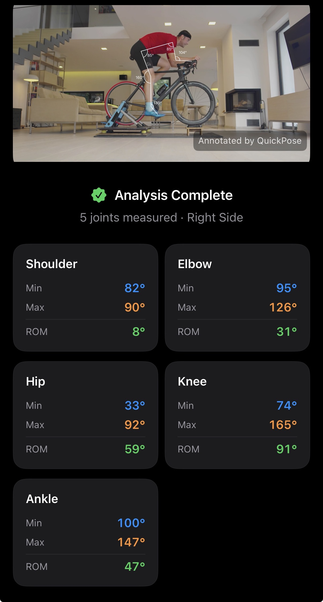

# BikeVision



A sample iOS app that uses the [QuickPose SDK](https://quickpose.ai) to measure cycling biomechanics from a live camera feed or an uploaded video. It is published as a starting point for developers building their own bike-fit and biomechanics tools.

## What it does

- **Record** — opens the rear camera, lets the user pick which side of the cyclist is visible, then starts a live QuickPose analysis that overlays joint angle arcs in real time. Tapping Stop collects the min/max angle for each joint and shows a results summary.
- **Upload** — the user selects a cycling video from their photo library, optionally trims it to the relevant pedal strokes, picks the cyclist side, then QuickPosePostProcessor renders an annotated output video and computes per-joint statistics. The annotated clip can be shared directly from the results screen.

### Joints measured

| Joint | Right-side cyclist | Left-side cyclist |
|---|---|---|
| Shoulder | anticlockwise | clockwise |
| Elbow | anticlockwise | clockwise |
| Hip | anticlockwise | clockwise |
| Knee | clockwise | anticlockwise |
| Ankle | anticlockwise | clockwise |

The `clockwiseDirection` parameter for each joint is set in `Config.swift` and is automatically derived from the selected `CyclingSide`.

---

## Requirements

| | |
|---|---|
| Xcode | 16 or later |
| iOS deployment target | 17.0 or later |
| Device | Physical iPhone or iPad (camera/ML required — simulator will not work) |
| QuickPose SDK key | Free key from [dev.quickpose.ai](https://dev.quickpose.ai) |

---

## Getting started

### 1. Clone the repo

```bash
git clone https://github.com/quickpose/BikeVision.git
cd BikeVision
```

### 2. Open in Xcode

```bash
open BikeVision.xcodeproj
```

Xcode will automatically resolve the QuickPose Swift Package dependency from:
```
https://github.com/quickpose/quickpose-ios-sdk
```

### 3. Add your SDK key

Open `BikeVision/Config.swift` and replace the placeholder with your free key:

```swift
static let quickPoseSDKKey = "YOUR_SDK_KEY_HERE"
```

Get a key at [dev.quickpose.ai](https://dev.quickpose.ai) — it takes under a minute.

### 4. Set the development team

In the project navigator select the **BikeVision** target → **Signing & Capabilities** → choose your Apple Developer team.

### 5. Run on a device

Select your connected iPhone or iPad and press **Run** (⌘R).

---

## Project structure

```
BikeVision/
├── Config.swift            # SDK key, cycling feature definitions, CyclingSide enum
├── BikeSession.swift       # JointStat, AngleAccumulator, BikeSession model
├── BikeVisionApp.swift     # App entry point
├── ContentView.swift       # Home screen + NavigationStack router (AppRoute)
├── SidePickerView.swift    # Left / right side selection
├── LiveCameraView.swift    # Real-time QuickPose camera analysis
├── UploadFlowView.swift    # Video picker sheet (PhotosPicker)
├── TrimView.swift          # Optional video trim (AVAssetExportSession)
├── ProcessingView.swift    # QuickPosePostProcessor with progress bar
└── ResultsView.swift       # Annotated video player + joint stat cards
```

### Navigation flow

```
ContentView (NavigationStack)
├── Record → SidePickerView → LiveCameraView → ResultsView
└── Upload → UploadFlowView (sheet)
               └── TrimView → SidePickerView → ProcessingView → ResultsView
```

Navigation is driven by a typed `AppRoute` enum stored in a `NavigationStack` path, so `ResultsView` can pop all the way back to the home screen with a single `path.removeAll()` call.

---

## Customising the app

### Change which joints are measured

Edit the `cyclingFeatures(side:)` function in `Config.swift`. Add or remove `.rangeOfMotion(...)` entries using any joint available in the QuickPose SDK — full list in the [QuickPose docs](https://docs.quickpose.ai).

```swift
static func cyclingFeatures(side: CyclingSide) -> [QuickPose.Feature] {
    let isLeftSide = side == .left
    let s: QuickPose.Side = isLeftSide ? .left : .right
    return [
        .rangeOfMotion(.knee(side: s, clockwiseDirection: !isLeftSide), style: bikeStyle),
        // add more joints here
    ]
}
```

### Change the overlay style

Adjust `bikeStyle` in `Config.swift`:

```swift
static let bikeStyle = QuickPose.Style(
    relativeFontSize: 0.33,   // size of angle label relative to frame height
    relativeArcSize: 0.4,     // size of angle arc relative to limb length
    relativeLineWidth: 0.3    // thickness of skeleton lines
)
```

### Persist sessions

`BikeSession` is a plain Swift struct — drop it into CoreData, SwiftData, or write the annotated video URL to a persistent store to build a session history screen.

---

## QuickPose SDK packages used

| Package | Purpose |
|---|---|
| `QuickPoseCore` | Pose detection engine and feature API |
| `QuickPoseMP` | MediaPipe model weights |
| `QuickPoseCamera` | `QuickPoseCameraView` — drop-in camera feed |
| `QuickPoseSwiftUI` | `QuickPoseOverlayView` — renders the annotated overlay image |

---

## Permissions

The following keys are set in the project build settings and appear in the generated `Info.plist` automatically:

| Key | Reason |
|---|---|
| `NSCameraUsageDescription` | Record flow needs camera access |
| `NSPhotoLibraryUsageDescription` | Upload flow needs photo library access |

---

## License

Apache 2.0. See [LICENSE](LICENSE) for details.

This sample app is provided by [QuickPose](https://quickpose.ai) to help developers build sports and fitness applications. It is not intended as production-ready bike-fit software.
